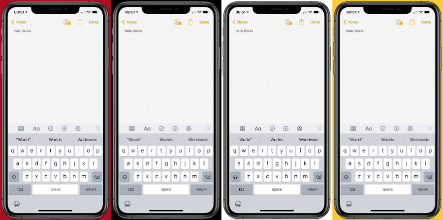
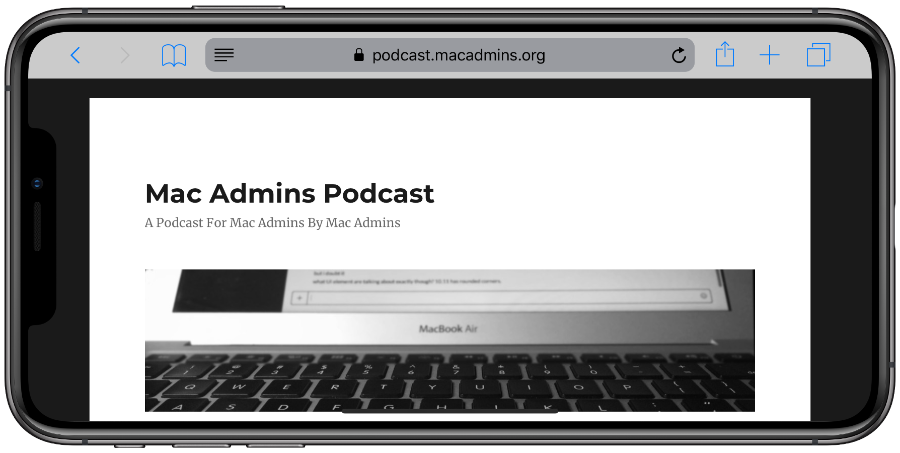

# iPhone Frame Overlay
This `python` script uses `ffmpeg` to convert an iOS screen recording from an iPhone XS Max, and overlay an image of the device "frame" on top of the video.

This was inspired by an iOS Shortcut that added an iOS device "frame" overlay onto a screenshot.




## Requirements
- Tested on `python 2.7.10` on macOS, and with `ffmpeg 4.0.2-tessus` for macOS
- `ffmpeg` must be installed in `/usr/local/bin` - available from https://www.ffmpeg.org/download.html

## Usage
### Clone
```
git clone https://github.com/carlashley/iphone_overlay && cd iphone_overlay && chmod +x iphoneoverlay.py
```

### View Help
```
[jappleseed@pegasus]:iphone_overlay # ./iphoneoverlay.py -h
usage: iphoneoverlay.py [-h] [-a] -i <filename.mp4> [-o <filename.mp4>]
                        [-c "#ffffff"] --overlay <device frame>
                        [--orientation <orientation>] [-d] [-v]

optional arguments:
  -h, --help            show this help message and exit
  -a, --keep-audio      Keep audio.
  -i, --input <filename.mp4>
                        Screen recording to add device frame to.
  -o, --output <filename.mp4>
                        Destination video filename.
  -c, --bg-colour "#ffffff"
                        Background colour. If specifying RGB code, quote the
                        code. For example: "#ffffff"
  --overlay <device frame>
                        Device frame to use as overlay.
  --orientation <orientation>
                        Orientation of final video. Defaults to portrait.
  -d, --debug           Debug output.
  -v, --version         show program's version number and exit
```
iOS screen recordings will need to be saved to your Mac in order to create the overlay.

## Usage Examples
### Required arguments
Both `-i, --input` and `--overlay` are required arguments.

### Basic run with only input video file and overlay
```
[jappleseed@pegasus]:iphone_overlay # ./iphoneoverlay.py -i ~/Downloads/Portrait.mp4 --overlay iphoneXSmax
Resizing source video to match device frame iPhone-XS-Max-Portrait-Space-Gray.png image size in portrait orientation and applying overlay.
frame=  490 fps= 45 q=-1.0 Lsize=     680kB time=00:00:08.11 bitrate= 686.1kbits/s dup=2 drop=0 speed=0.746x    
Video saved to: /Users/jappleseed/Downloads/Portrait_overlay.mp4
```

### Specify input video file, overlay, and background colour, no output filename
```
[jappleseed@pegasus]:iphone_overlay # ./iphoneoverlay.py -i ~/Downloads/Portrait.mp4 --overlay iphoneXSmax --bg-colour="#b00d23"
Resizing source video to match device frame iPhone-XS-Max-Portrait-Space-Gray.png image size in portrait orientation and applying overlay.
frame=  490 fps= 45 q=-1.0 Lsize=     693kB time=00:00:08.11 bitrate= 699.2kbits/s dup=2 drop=0 speed=0.752x    
Video saved to: /Users/jappleseed/Downloads/Portrait_overlay.mp4
```

### Specify input video file, output video file, background colour, overlay, and orientation
```
[jappleseed@pegasus]:iphone_overlay # ./iphoneoverlay.py -i ~/Downloads/Portrait.mp4 -o HelloWorld_Landscape.mp4 --bg-colour="#ffffff" --overlay iphoneXSmax --orientation landscape
Resizing source video to match device frame iPhone-XS-Max-Portrait-Space-Gray.png image size in landscape orientation and applying overlay.
frame=  490 fps= 55 q=-1.0 Lsize=     703kB time=00:00:08.11 bitrate= 709.5kbits/s dup=2 drop=0 speed=0.912x
Video saved to: /Users/jappleseed/Documents/git/Portrait_overlay.mp4
```

## Limitations
- Currently only works for video recorded on an iPhone XS Max.
- If the screen recording or video being inserted into the device frame is smaller than the device frame, the background colour will be visible.
